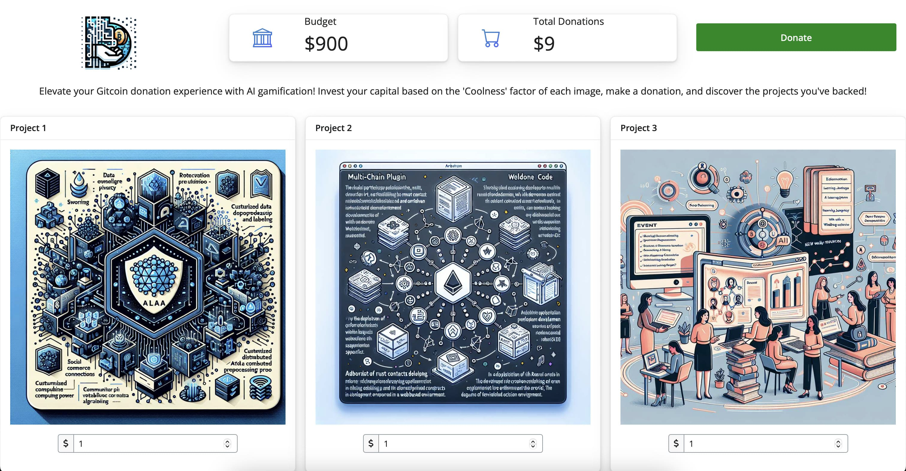

# PixelPitch.ai

Elevate your Gitcoin donation experience with AI gamification! Invest your capital based on the 'Coolness' factor of each image, make a donation, and discover the projects you've backed!

<br>

## [App Walkthrough on YouTube](https://www.youtube.com/watch?v=hS9c5) <<< Click Here

## [App deployed on a tiny droplet](http://) <<< Click Here

<hr>

### Walkthrough

#### 1. Open R and install the requirements using

```
install.packages("shiny")
install.packages("shinyjs")
install.packages("bslib")
install.packages("bsicons")
install.packages("readr")
install.packages("shinyWidgets")
devtools::install_github("OmniacsDAO/alloDataR")
```
#### 2. Clone this repo and set the R path to the repo.

```
setwd("~/Desktop/PixelPitch.ai)
```

#### 3. Load the alloDataR package and download the Project Data frame from Arbitrum Chain and save the projects which have rich description (>100 characters)

```
library(alloDataR)
library(readr)
data <- chainProjectData(42161)
write_csv(data[nchar(data$projectDescription)>100,],"data/arbProjectsDFg100.csv")
```

#### 4. Generate the images for all of those project descriptions and save them in the www folder (Can be done with API or manually)


#### 5. Run the Shiny Dashboard

```
library(shiny)
runApp()
```


<div align="center">Dashboard</div>

<hr>